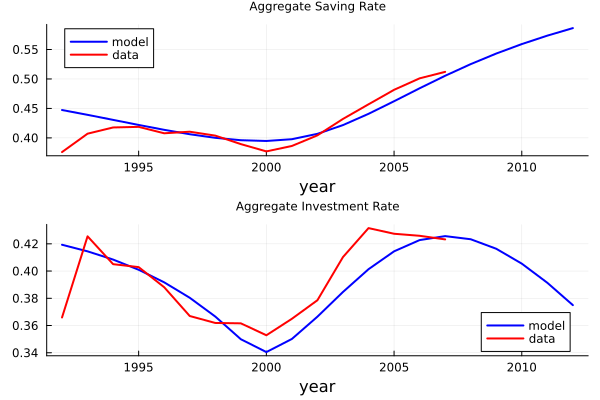
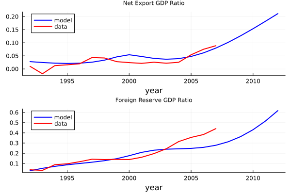
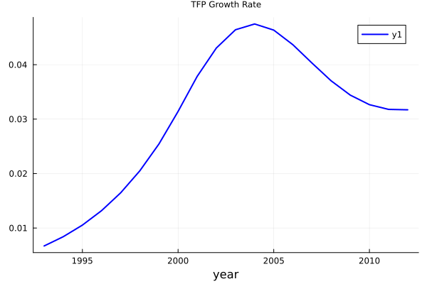
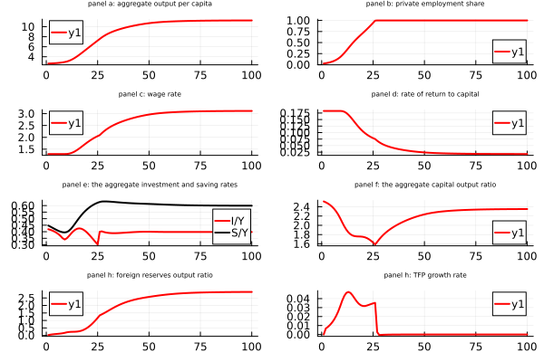
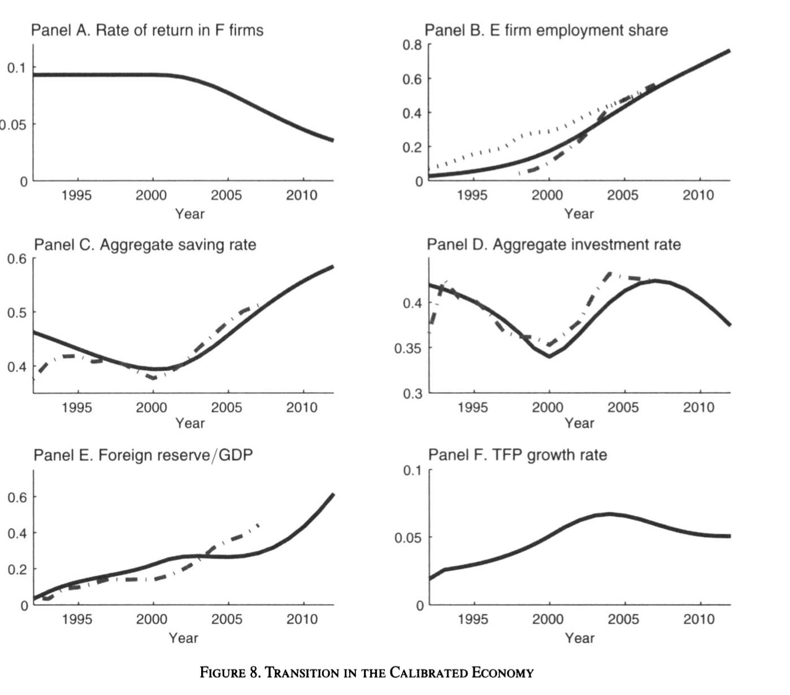

## Overview
The paper we replicated is:
[Growing Like China](https://www.jstor.org/stable/pdf/41038787.pdf?casa_token=5TRRgOIMQUwAAAAA:iVWOCu1JLzX5JQy2T2r9Tt9uXl7Z-QMtq3em5ARvBx2A2GD_6kNZ1Bn59fD2NWlJNoQUxO6I5pcKMVmLYTngAwDwjh7EMMXvuQTWPsbmvoVMvSiSd38)

These scripts are used to set up the model parameters, perfrom simulation and visualize the results, which are used to simulate various economic phenomena during China's economic transition as discussed in the paper.

## Scripts Description and Relationship

### `parameter.jl`
- **Purpose**: Initializes the basic parameters and global variables of the economic model and is responsible for running the entire replication process.
- **Importance**: Provides the parameter base for all calculations in the model and automates the entire process by introducing additional scripts to generate all necessary output files.

### `pre_transition.jl`
- **Purpose**: Modeling economic behavior and states prior to any major economic transition.
- **Features**: Calculate the initial wealth, savings and consumption of workers and entrepreneurs, provides underlying data for initial state visualization and baseline scenarios.
- **Functions Included**：
  - `fun_saving_pre_transition`
  - `fun_saving_pre_transition_E`

### `transition.jl`
- **Purpose**: Manages the simulation of the economy during transition periods.
- **Features**: Iteratively adjust economic variables to model changes due to policy or external factors. Generate time series data for dynamic visualization of economic transitions.
- **Functions Included**：
  - `fun_saving_E_existing`
  - `fun_saving_E_newly_born`
  - `fun_saving_F_existing`
  - `fun_saving_F_newly_born`

### `result.jl`
- **Purpose**: Summarize and analyze the replication results for each phase.
- **Features**: Calculate comprehensive economic indicators and prepare final visualizations and generate detailed charts and tables summarizing model outputs.
- **Relationship**:
  - Data generated using `pre_transition.jl` and `transition.jl`.
  - The output is visualized in detail in `six_panel.jl`.

### `six_panel.jl`
- **Purpose**: Visualizes the results of the model in a structured six-panel format.
- **Features**: Each panel displays a different key economic indicator, such as the rate of return, employment share, savings rate, and so on.
- **Relationship**:
  - Directly relies on `result.jl` aggregated and analyzed data.
  - The visualization provides empirical validation of the model by comparing simulated data with actual economic data.

## Figures
- **Figure 1-6**：
  - **Generation method**：Generated by code in the `six_panel.jl` script, combined with aggregated data in `result.jl`.
  - **Corresponding files**：Individual panel plots rely on economic behavior data computed by functions such as `fun_saving_F_newly_born` used in `transition.jl`. Displaying various economic indicators such as savings rate, investment rate, employment share and TFP growth, these panels rely on data aggregated and analyzed by `result.jl`, `six_panel.jl` utilizes the output data of `result.jl` to display the results computed from `pre_transition.jl` and `transition.jl`. results from `pre_transition.jl` and `transition.jl` calculations.

## Execution Order and Dependencies
1.Run `main_parameter.jl` will automatically perform the following steps:
- Set the global economic parameters.
- Run `pre_transition.jl`, `transition.jl`, `result.jl`, and `six_panel.jl` in sequence to generate all outputs of the model and visualize the charts.

To be more specific,
1. **Economy Before Transition**：
   - Run `pre_transition.jl` to model any pre-transition economic conditions and behaviors.
2. **Run Transition Simulation**：
   - Run `transition.jl` to simulate adjustments to the economic transition.
3. **Analysis of Results**：
   - `result.jl` aggregates data from previous process and conduct a comprehensive economic analysis.
4. **Visualization**：
   - Finally, `six_panel.jl` visualizes the results of the economic model and its predictions.
  
# Figures

- **Model Prediction**: Investment and saving rates show fluctuations.
- **Actual Data**: The actual data also shows similar trends, though the model exhibits larger fluctuations in some periods.
  

- **Model Prediction**: The model predicts a steady increase in the Net Export GDP Ratio over time, suggesting that the economy becomes more export-oriented and improves its trade balance in the first figure. The share of private employment gradually increases, reflecting the growing importance of the private sector during economic transformation in the second figure.
- **Actual Data**: The actual data also shows an increasing trend in the Net Export GDP Ratio, though there are some fluctuations. The model captures the general upward trend but may overestimate the growth rate in certain periods in figure 1. The actual data also shows a rising trend, though the model predicts a slightly faster growth rate in figure 2.
  

- **Model Prediction**: The capital output ratio initially decreases, then increases, and eventually stabilizes.
- **Actual Data**: The trend in actual data is similar, though the model predicts a higher stable level.
  

- **Model Prediction**: The TFP growth rate rises rapidly initially and then gradually decreases.
- **Actual Data**: The actual data shows a similar trend, but the model predicts a higher peak.
  

- **Model Prediction**: Iceberg costs gradually decrease.
- **Actual Data**: The trend in actual data is consistent, though the model predicts a faster decline.
  

- **Model Prediction**: The model predicts that the rate of return to capital initially increases, reaches a peak, and then gradually decreases in figure 1. The model predicts a gradual increase in the labor share over time, indicating that a larger portion of national income is being allocated to workers in figure 2.
- **Actual Data**: The actual data shows a similar trend, with the rate of return to capital increasing initially and then stabilizing or slightly declining in figure 1. The actual data shows a similar upward trend in labor share, reflecting improvements in wages and labor conditions in figure 2.
  

- **Model Prediction**: The model predicts a gradual increase in the private employment share over time, reflecting a transition towards a more market-oriented economy in figure 1. The model predicts a high initial growth rate in private employment share, which eventually slows down as the economy stabilizes and the private sector matures in figure 2.
- **Actual Data**: The actual data shows an upward trend in private employment share, although the model may predict a slightly faster increase in figure 1. The actual data shows a similar trend, with rapid growth in the early stages of economic transition, followed by a gradual deceleration in figure 2.

The six-panel figure presents a comparison of various economic indicators between the model's predictions and actual data.

#### Panel 1: Rate of Return in F Firms
- **Model Prediction**: The model shows a gradual increase in the rate of return for F firms over time.
- **Actual Data**: The actual data reflects a similar trend with fluctuations.
- **Conclusion**: The model captures the general upward trend but might not fully account for short-term fluctuations observed in the actual data.

#### Panel 2: E Firm Employment Share
- **Model Prediction**: The model predicts a steady increase in the employment share of E firms.
- **Actual Data**: The actual data also shows an increasing trend but with more pronounced fluctuations.
- **Conclusion**: The model effectively captures the long-term trend but may not fully replicate the volatility seen in the actual data.

#### Panel 3: Aggregate Saving Rate
- **Model Prediction**: The model shows an increasing trend in the aggregate saving rate, particularly post-2000.
- **Actual Data**: The actual data reflects a similar trend, with a notable dip around 2000 and subsequent rise.
- **Conclusion**: The model closely follows the actual data trend, validating its accuracy in predicting saving behaviors.

#### Panel 4: Aggregate Investment Rate
- **Model Prediction**: The model shows fluctuations in the aggregate investment rate, with a general upward trend.
- **Actual Data**: The actual data exhibits similar fluctuations but with slightly different timing and magnitude.
- **Conclusion**: The model captures the overall pattern but may need adjustments to better align with the specific timing of changes in the actual data.

#### Panel 5: Foreign Reserve / GDP
- **Model Prediction**: The model predicts a steady increase in the ratio of foreign reserves to GDP.
- **Actual Data**: The actual data shows a similar upward trend with occasional dips.
- **Conclusion**: The model aligns well with the actual data, suggesting it effectively captures the factors influencing foreign reserve accumulation.

#### Panel 6: TFP Growth Rate
- **Model Prediction**: The model predicts a rise in the Total Factor Productivity (TFP) growth rate until around 2005, followed by a decline.
- **Actual Data**: The actual data also shows an initial increase and subsequent decrease in the TFP growth rate.
- **Conclusion**: The model accurately captures the trend in TFP growth, reflecting its robustness in simulating productivity dynamics.

### Overall Conclusions from the Six-Panel Figure

1. **Model Validation**: The six-panel comparison shows that the model generally aligns well with actual data trends, providing validation for the model's assumptions and parameters.
2. **Trend Capturing**: The model is effective in capturing long-term trends in key economic indicators such as the rate of return, employment share, saving rate, investment rate, foreign reserves, and TFP growth.
3. **Fluctuations and Volatility**: While the model captures overall trends, it may not fully account for short-term fluctuations and volatility seen in the actual data. This suggests potential areas for further refinement in the model.
4. **Policy Implications**: The close alignment between the model's predictions and actual data trends suggests that the model can be a useful tool for policymakers in forecasting and planning. Understanding these economic indicators helps in designing informed economic policies.

### Conclusion

The model effectively captures the trends of key economic variables such as economic growth, employment, wages, capital returns, investment, and saving rates. Despite some discrepancies in certain periods or variables, the model performs well in replicating the major characteristics of economic transformation.

# Comparison
Then, we compare our replication results and the original results. We can see from the two figures that our replication is mostly the same as the paper had. So the result would be similar. 

This figure depicts the evolution of key variables during and after the economic transition in a calibrated economic model. The solid and dashed lines in the figure represent the simulation results of the model and the actual data, respectively. The figure illustrates the speed of employment reallocation, the evolution of the savings rate (in a U-shaped dynamic), and the trend in the foreign exchange surplus. The increase in the savings rate is associated with a higher savings rate for E-firm managers, which is the main mechanism driving the increase in savings. At the same time, the model accurately predicts the trend in the foreign exchange surplus, albeit with a slight bias in some years. These demonstrate the degree of agreement and discrepancy between the model and China's actual economic data.

Now we are going to details about the function and the logic.

# Life-Cycle Savings and Consumption Model

This repository contains a Julia implementation of a life-cycle savings and consumption model as part of a macroeconomic analysis. The key functions compute the wealth and consumption profiles of newly born workers, existing workers, newly born entrepreneurs, existing entrepreneurs, and individuals in the pre-transition phase over their lifetime.

## Function: `fun_saving_F_newly_born`

### Description

The function `fun_saving_F_newly_born` simulates the life-cycle savings and consumption behavior of newly born workers based on various economic parameters.

### Inputs

- `x::Vector`: A vector containing the current time period `tt`.
- `dictmain::Dict`: Dictionary containing main parameters:
  - `age_max`: Maximum age of the workers.
  - `age_T_w`: Age until which workers earn wages.
  - `g_t`: Growth rate of wages.
  - `r`: Interest rate.
  - `bet`: Discount factor.
  - `sig`: Intertemporal elasticity of substitution.
- `dictopt::Dict`: Dictionary containing optional parameters:
  - `w_t`: Time series of wages.

### Outputs

- `result::Dict`: A dictionary containing:
  - `:wealth`: Array of wealth over the worker's lifetime.
  - `:consumption`: Array of consumption over the worker's lifetime.

### Function Logic

1. **Initialization**:
    - `wealth`: An array to store the wealth of workers over their lifetime, initialized to zeros.
    - `w`: An array to store the life-cycle earnings of workers.

2. **Life-Cycle Earnings Computation**:
    - Calculates earnings for each age, adjusted for growth and interest rates. Workers earn wages until they reach retirement age `age_T_w`.

3. **Lifetime Wealth Calculation**:
    - Computes total lifetime wealth as the sum of the discounted life-cycle earnings.

4. **Optimal Consumption and Savings**:
    - Computes the ratio of optimal consumption over time, adjusted based on the discount factor, interest rate, and growth rate.
    - Updates wealth to reflect the savings after accounting for consumption.

5. **Output**:
    - Returns a dictionary with `:wealth` and `:consumption`.

## Function: `fun_saving_F_existing`

### Description

The function `fun_saving_F_existing` simulates the life-cycle savings and consumption behavior of existing workers based on their current age and wealth, along with various economic parameters.

### Inputs

- `x::Vector`: A vector containing:
  - `age`: Current age of the worker.
  - `wealth`: Current wealth of the worker.
- `dictmain::Dict`: Dictionary containing main parameters:
  - `age_max`: Maximum age of the workers.
  - `age_T_w`: Age until which workers earn wages.
  - `g_t`: Growth rate of wages.
  - `r`: Interest rate.
  - `bet`: Discount factor.
  - `sig`: Intertemporal elasticity of substitution.
- `dictopt::Dict`: Dictionary containing optional parameters:
  - `w_t`: Time series of wages.

### Outputs

- `result::Dict`: A dictionary containing:
  - `:wealth`: Array of wealth over the worker's remaining lifetime.
  - `:consumption`: Array of consumption over the worker's remaining lifetime.

### Function Logic

1. **Initialization**:
    - `wealth`: An array to store the wealth of workers over their remaining lifetime, initialized to zeros.
    - `w`: An array to store the life-cycle earnings of workers.

2. **Life-Cycle Earnings Computation**:
    - Calculates earnings for each remaining age, adjusted for growth and interest rates. Workers earn wages until they reach retirement age `age_T_w`.

3. **Lifetime Wealth Calculation**:
    - Computes total remaining lifetime wealth as the sum of the discounted life-cycle earnings and current wealth.

4. **Optimal Consumption and Savings**:
    - Computes the ratio of optimal consumption over time, adjusted based on the discount factor, interest rate, and growth rate.
    - Updates wealth to reflect the savings after accounting for consumption.

5. **Output**:
    - Returns a dictionary with `:wealth` and `:consumption`.

## Function: `fun_saving_E_newly_born`

### Description

The function `fun_saving_E_newly_born` simulates the life-cycle savings and consumption behavior of newly born entrepreneurs based on various economic parameters.

### Inputs

- `x::Vector`: A vector containing the current time period `tt`.
- `dictmain::Dict`: Dictionary containing main parameters:
  - `age_max`: Maximum age of the entrepreneurs.
  - `age_T`: Age until which entrepreneurs earn wages.
  - `g_t`: Growth rate of wages.
  - `r`: Interest rate.
  - `bet_E`: Discount factor for entrepreneurs.
  - `sig`: Intertemporal elasticity of substitution.
  - `ice_t`: Borrowing constraint factor.
  - `eta`: Parameter related to the borrowing constraint.
- `dictopt::Dict`: Dictionary containing optional parameters:
  - `m_t`: Time series of entrepreneurial wages.
  - `rho_t`: Time series of returns on investments.

### Outputs

- `result::Dict`: A dictionary containing:
  - `:wealth`: Array of wealth over the entrepreneur's lifetime.
  - `:consumption`: Array of consumption over the entrepreneur's lifetime.

### Function Logic

1. **Initialization**:
    - `wealth`: An array to store the wealth of entrepreneurs over their lifetime, initialized to zeros.
    - `w`: An array to store the life-cycle earnings of entrepreneurs.

2. **Life-Cycle Earnings Computation**:
    - Calculates earnings for each age, adjusted for growth and interest rates. Entrepreneurs earn wages until they reach a certain age `age_T`.

3. **Adjusting Rate of Return**:
    - Adjusts the rate of return due to the endogenous borrowing constraint using the parameters `rho_t`, `r`, `ice_t`, and `eta`.

4. **Lifetime Wealth Calculation**:
    - Computes total lifetime wealth as the sum of the discounted life-cycle earnings.

5. **Optimal Consumption and Savings**:
    - Computes the ratio of optimal consumption over time, adjusted based on the discount factor, interest rate, and growth rate.
    - Updates wealth to reflect the savings after accounting for consumption.

6. **Output**:
    - Returns a dictionary with `:wealth` and `:consumption`.

## Function: `fun_saving_E_existing`

### Description

The function `fun_saving_E_existing` simulates the life-cycle savings and consumption behavior of existing entrepreneurs based on their current age and wealth, along with various economic parameters.

### Inputs

- `x::Vector`: A vector containing:
  - `age`: Current age of the entrepreneur.
  - `wealth`: Current wealth of the entrepreneur.
- `dictmain::Dict`: Dictionary containing main parameters:
  - `age_max`: Maximum age of the entrepreneurs.
  - `age_T`: Age until which entrepreneurs earn wages.
  - `g_t`: Growth rate of wages.
  - `r`: Interest rate.
  - `bet_E`: Discount factor for entrepreneurs.
  - `sig`: Intertemporal elasticity of substitution.
  - `ice_t`: Borrowing constraint factor.
  - `eta`: Parameter related to the borrowing constraint.
- `dictopt::Dict`: Dictionary containing optional parameters:
  - `m_t`: Time series of entrepreneurial wages.
  - `rho_t`: Time series of returns on investments.

### Outputs

- `result::Dict`: A dictionary containing:
  - `:wealth`: Array of wealth over the entrepreneur's remaining lifetime.
  - `:consumption`: Array of consumption over the entrepreneur's remaining lifetime.

### Function Logic

1. **Initialization**:
    - `wealth`: An array to store the wealth of entrepreneurs over their remaining lifetime, initialized to zeros.
    - `w`: An array to store the life-cycle earnings of entrepreneurs.

2. **Life-Cycle Earnings Computation**:
    - Calculates earnings for each remaining age, adjusted for growth and interest rates. Entrepreneurs earn wages until they reach retirement age `age_T`.

3. **Adjusting Rate of Return**:
    - Adjusts the rate of return due to the endogenous borrowing constraint using the parameters `rho_t`, `r`, `ice_t`, and `eta`.

4. **Lifetime Wealth Calculation**:
    - Computes total remaining lifetime wealth as the sum of the discounted life-cycle earnings and current wealth.

5. **Optimal Consumption and Savings**:
    - Computes the ratio of optimal consumption over time, adjusted based on the discount factor, interest rate, and growth rate.
    - Updates wealth to reflect the savings after accounting for consumption.

5. **Output**:
    - Returns a dictionary with `:wealth` and `:consumption`.

## Function: `fun_saving_pre_transition`

### Description

The function `fun_saving_pre_transition` simulates the life-cycle savings and consumption behavior of individuals in the pre-transition phase based on their current age, wage, and wealth, along with various economic parameters.

### Inputs

- `x::Vector`: A vector containing:
  - `age`: Current age of the individual.
  - `wage`: Current wage of the individual.
  - `wealth`: Current wealth of the individual.
- `dict::Dict`: Dictionary containing parameters:
  - `age_max`: Maximum age of the individual.
  - `age_T_w`: Age until which individuals earn wages.
  - `g_t`: Growth rate of wages.
  - `r`: Interest rate.
  - `bet`: Discount factor.
  - `sig`: Intertemporal elasticity of substitution.

### Outputs

- `y::Vector`: A vector containing:
  - `savings`: Current savings.
  - `wealth_prime`: Wealth in the next period.
  - `sr`: Saving rate.
  - `consumption`: Current consumption.

### Function Logic

1. **Initialization**:
    - `wealth`: An array to store the wealth of individuals over their lifetime, initialized to zeros.
    - `w`: An array to store the life-cycle earnings of individuals.

2. **Life-Cycle Earnings Computation**:
    - Calculates earnings for each remaining age, adjusted for growth and interest rates. Individuals earn wages until they reach retirement age `age_T_w`.

3. **Lifetime Wealth Calculation**:
    - Computes total remaining lifetime wealth as the sum of the discounted life-cycle earnings and current wealth.

4. **Optimal Consumption and Savings**:
    - Computes the ratio of optimal consumption over time, adjusted based on the discount factor, interest rate, and growth rate.
    - Updates wealth to reflect the savings after accounting for consumption.

5. **Output**:
    - Returns a vector with `savings`, `wealth_prime`, `sr`, and `consumption`.

## Function: `fun_saving_pre_transition_E`

### Description

The function `fun_saving_pre_transition_E` simulates the life-cycle savings and consumption behavior of entrepreneurs in the pre-transition phase based on their current age, wage, and wealth, along with various economic parameters.

### Inputs

- `x::Vector`: A vector containing:
  - `age`: Current age of the entrepreneur.
  - `wage`: Current wage of the entrepreneur.
  - `wealth`: Current wealth of the entrepreneur.
- `dict::Dict`: Dictionary containing parameters:
  - `age_max`: Maximum age of the entrepreneur.
  - `age_T_w`: Age until which entrepreneurs earn wages.
  - `g_t`: Growth rate of wages.
  - `r`: Interest rate.
  - `bet_E`: Discount factor for entrepreneurs.
  - `sig`: Intertemporal elasticity of substitution.

### Outputs

- `y::Vector`: A vector containing:
  - `savings`: Current savings.
  - `wealth_prime`: Wealth in the next period.
  - `sr`: Saving rate.
  - `consumption`: Current consumption.

### Function Logic

1. **Initialization**:
    - `wealth`: An array to store the wealth of entrepreneurs over their lifetime, initialized to zeros.
    - `w`: An array to store the life-cycle earnings of entrepreneurs.

2. **Life-Cycle Earnings Computation**:
    - Calculates earnings for each remaining age, adjusted for growth and interest rates. Entrepreneurs earn wages until they reach retirement age `age_T_w`.

3. **Lifetime Wealth Calculation**:
    - Computes total remaining lifetime wealth as the sum of the discounted life-cycle earnings and current wealth.

4. **Optimal Consumption and Savings**:
    - Computes the ratio of optimal consumption over time, adjusted based on the discount factor, interest rate, and growth rate.
    - Updates wealth to reflect the savings after accounting for consumption.

5. **Output**:
    - Returns a vector with `savings`, `wealth_prime`, `sr`, and `consumption`.

